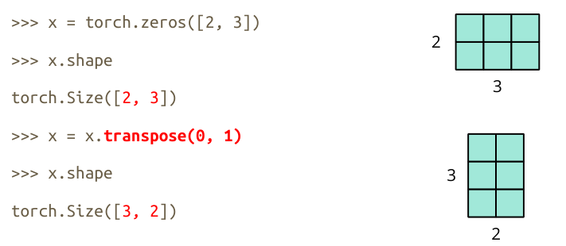

# 机器学习笔记

## 1.机器学习基本概念

> 三类任务：
>
> ​	Regression
>
> ​	Classification
>
> ​	Structure Learning

机器学习的目的就是寻找一个**Function**：下面是寻找一个**F**的步骤：

1. **with Unknown Parameters** $Model:y=b+wx_1$ 参数说明 $x_1:feature,w:weight,b:bias$
   
2. **Define Loss from Training Data**

   **Loss is a function of parameters:** $L(b,w)$
   
   **Loss**:how good a set of values is.
   
   $Loss: L=\frac{1}{N}\sum_n{e_n}$ ,损失函数是计算 $y$ 与 $\hat{y}(label)$ 之间的距离
   
   **Loss的类别**：
   $$
   e=|y-\hat{y}|\;\;\;L\;is\;mean\;absolute\;error(MAE)\\
   e=(y-\hat{y})^2\;\;\;L\;is\;mean\;square\;error(MSE)\\
   If\;y\;and\;\hat{y}\;are\;both\;probability\;distributions\;\rightarrow Cross-entropy(交叉熵损失)
   $$
   
3. **Optimization**

   **Gradient Descent**:(梯度下降) $w^{*},b^{*}=arg\;\underset{w,b}\min L$

   - (Randomly)Pick an initial value $w^0,b^0$
   
   - Compute $\frac{\partial L}{\partial w}|_w=w^0,\frac{\partial L}{\partial b}|_b=b^0$, 决定$w$更新的快慢由学习率决定：
   
     $\eta\frac{\partial L}{\partial w}|_w=w^0\;\eta:learning\;rate(hyper\;parameters)$ 
   
     $w^1\leftarrow w^0-\eta\frac{\partial L}{\partial w}|_w=w^0$
   
     $b^1\leftarrow b^0-\eta\frac{\partial L}{\partial b}|_b=b^0$
   
   - Update $w$ and $b$ iteratively
   
     > 梯度下降在更新 $w$ 的时候存在local minima和global minima的争议，但local minima在训练的过程中可能是个假议题。
     
     

## 2.Google Colab

`nvidia-smi`:查看分配的GPU（P100>T4>k80）

## 3.Pytorch

1. **Training & Testing Neural Networks** -in Pytorch **Step 1**

 

2. **Dataset & Dataloader**

   Dataset:    stores data samples and expected values

   Dataloader: groups data in batches,enables multiprocessing

   ```python
   dataset = MyDataset(file)
   dataloader = DataLoader(dataset,batch_size,shuffle=True)
   # Training:True Testing:False
   ```

   ```python
   from torch.utils.data import Dataset,DataLoader
   
   class MyDataset(Dataset):
       #Read data & preprocess
       def __init__(self,file):
           self.data = ...
           return 
       #Returns one sample at a time
       def __getitem__(self,index):
           return self.data[index]
       #Returns the size of the dataset
       def __len__(self):
           return len(self.data)
   ```

   

3. **Tensors**

   `Tensors - Shape of Tensors`

   

   `Tensors - Create Tensors`

   

   `Tensors - Common Operations`

   - Addition: 		z=x+y

   - Subtraction:      z=x-y

   - Power:            y=x.pow(2)

   - Summation:        y=x.sum()

   - Mean:             y=x.mean()

   - Transpose:transpose two specified dimensions

     

   - Squeeze(挤):remove the specified dimension with length = 1

     

   - Unsqueeze:expand a new dimension

     

   - Cat:concatenate multiple tensors

     

   `Tensors - Data Type`

   |       Data type        |    dtype    |      tensor       |
   | :--------------------: | :---------: | :---------------: |
   | 32-bit floating point  | torch.float | torch.FloatTensor |
   | 64-bit integer(signed) | torch.long  | torch.LongTensor  |

   `Tensors – PyTorch v.s. NumPy`

   | Pytorch            | Numpy               |
   | ------------------ | ------------------- |
   | x.reshape / x.view | x.reshape           |
   | x.squeeze()        | x.squeeze()         |
   | x.unsqueeze(1)     | np.expand_dims(x,1) |
   | x.shape            | x.shape             |
   | s.dtype            | x.dtype             |

   `Tensors - Device`

   - Tensors & modules will be computed with CPU by default

     Use .to() to move tensors to appropriate devices.

   - CPU -> x=x.to('cpu')

   - GPU -> x=x.to('cuda')

   - Check if your computer has NVIDIA GPU

     ​		`torch.cuda.is_available()`

   - Multi GPUs: specify 'cuda:0','cuda:1',...

   `Tensors - Gradient Calculation`

   ```python
   x=torch.tensor([[1.,0.],[-1.,1.]],requires_grad=True)
   z=x.pow(2).sum()
   z.backward()
   x.grad
   ```

   

4. **Training & Testing Neural Networks** -in Pytorch **Step 2**

   

   `torch.nn - Network Layers`

   - Linear Layer(Fully-connected Layer)

     nn.Linear(in_features,out_features)

     

     

     

     ```python
     layer = torch.nn.Linear(32,64)
     layer.weight.shape # torch.Size([64,32])
     layer.bias.shape # torch.Size([64])
     ```

   `torch.nn - Non-Linear Activation Functions`

   - Sigmoid Activation:`nn.Sigmoid()`

     

   - ReLU Activation:`nn.ReLU()`

     

   `torch.nn - Build your own neural network`

   ```python
   import torch.nn as nn
   class MyModel(nn.Module):
       def __init__(self):
           super(MyModel, self).__init__()
           self.net = nn.Sequential(
               nn.Linear(10,32),
               nn.Sigmoid(),
               nn.Linear(32,1)
           )
   
       def forward(self,x):
           return self.net(x)
       
   """等价"""
   import torch.nn as nn
   class MyModel(nn.Module):
       def __init__(self):
           super(MyModel,self).__init__()
           self.layer1 = nn.Linear(10,32)
           self.layer2 = nn.Sigmoid()
           self.layer3 = nn.Linear(32,1)
           
       def forward(self,x):
           out = self.layer1(x)
           out = self.layer2(out)
           out = self.layer3(out)
           return out
           
   ```

5. **Training & Testing Neural Networks** -in Pytorch **Step 3**

   

   `torch.nn - Loss Function`

   - Mean Squared Error (for regression tasks) : `criterion = nn.MSELoss()`
   - Cross Entropy (for classification tasks) : `criterion = nn.CrossEntropyLoss()`
   - `loss criterion(model_output, expected_value)`

6. **Training & Testing Neural Networks** -in Pytorch **Step 4**

   > Gradient-based **optimization algorithms**(优化算法，最佳演算法) that adjust network parameters to reduce error.

   

   **E.g.** Stochastic Gradient Descent(SGD)(随机梯度下降)

   ​	`torch.optim.SGD(model.parameters(), lr, momentum = 0)`

   For every batch of data:

   1. Call optimizer.zero_grad() to reset gradients of model parameters.
   2. Call loss.backward() to backpropagate(反向传播) gradients of prediction loss.
   3. Call optimizer.step() to adjust model parameters.

7. **Training & Testing Neural Networks** -in Pytorch **Step 5**

   

   **`Neural Network Training Setup`**

   ```python
   dataset = MyDataset(file) # read data via MyDataset
   tr_set = DataLoader(dataser, 16, shuffle = True) # put dataset into Dataloader
   model = MyModel().to(device) # construct(构造) model and move to device (cpu/cuda)
   criterion = nn.MSELoss() # set loss function
   optimizer = torch.optim.SGD(model.parameters(), 0.1) # set opimizer
   ```

   **`Neural Network Training Loop`**

   ```python
   for epoch in range(n_epochs):           # iterate n_epochs
       model.train()                       # set model to train mode
       for x,y in tr_set:                  # iterate through the dataloader
           optimizer.zero_grad()           # set gradient to zero
           x,y = x.to(device), y.to(device)# move data to device(cpu/cuda)
           pred = model(x)                 # forward pass(compute output)
           loss = criterion(pred, y)       # compute loss
           loss.backward()                 #compute gradient(backpropagation)
           optimizer.step()                # update model with optimizer
   ```

   **`Neural Network Validation Loop`**

   ```python
   model.eval()                            # set model to evaluation mode
   total_loss = 0                          # 
   for x, y in dv_set:                     # iterate through the dataloader
       x, y = x.to(device), y.to(device)   # move data to device(cpu/cuda)
       with torch.no_grad():               # disable gradient calculation
           pred = model(x)                 # forward pass (compute output)
           loss = criterion(pred, y)       # compute loss
       total_loss += loss.cpu().item() * len(x)# accumulate loss
       avg_loss = total_loss / len(dv_set.dataset)# compute averaged loss
   ```

   **`Neural Network Testing Loop`**

   ```python
   model.eval()                         # set model to evaluation mode
   preds = []                           
   for x in tt_set:                     # iterate through the dataloader
       x = x.to(device)                 # move data to device (cpu/cuda)
       with torch.no_grad():            # disable gradient calculation
           pred = model(x)              # forward pass (compute output)
           preds.append(pred.cpu())     # collect prediction
   ```

   - model.eval()

     Changes behaviour of some model layers, such as dropout and batch normalization(归一化)

   - with torch.no_grad()

     Prevents calculations from being added into gradient computation graph. Usually used to prevent accidental training on validation/testing data. 

   **`Save/Load Trained Models`**

   - Save: `torch.save(model.state_dict(), path)`
   - Load:`ckpt = torch.load(path)` `model.load_state_dict(ckpt)`

## 4.Framework of ML

### 1.General Guide


### 2.`model bias`->loss on training data go large


### 3.`Optimization`->loss on training data go large


> Model Bias v.s. Optimization Issue
>
> - Gaining the insights from comparison
>
> - Start from shallower networks(or other models),which are easier to optimize.
>
> - If deeper networks do not obtain smaller loss on training data, then there is optimization issue
>
> - Solution: More powerful optimization technology(Adam). 
>
>   

### 4.`Overfitting`->Training data:small, Testing data:large

1. More training data
2. Data augmentation(数据增强：图片翻转)
3. Less parameters,sharing parameters
4. Less features
5. Early stopping
6. Regularization 
7. Dropout

`Bias-Complexity Trade-off`


> **Cross Validation(交叉验证)**
>
> 
>
> **N-fold Cross Validation**
>
> 

## 5.Optimization Fails because

